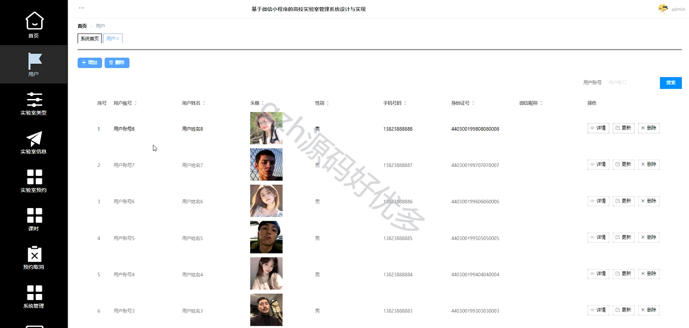
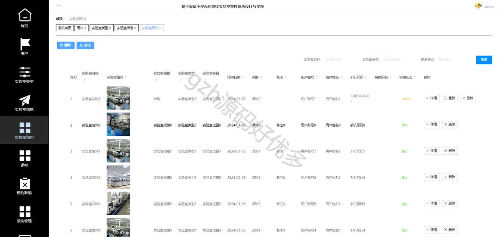

# mpweixinA058
mpweixinA058高校实验室微信小程序LW+PPT
 
## 查看主页获取源码

### 一、作品包含

源码+数据库+设计文档万字+PPT+全套环境和工具资源+部署教程

### 二、项目技术

前端技术：Html、Css、Js、Vue、Element-ui、Uniapp

数据库：MySQL

后端技术：Java、Spring Boot、MyBatis

  

### 三、运行环境

开发工具：IDEA/eclipse + HBuilderX + 微信开发者工具

数据库：MySQL5.7

数据库管理工具：Navicat10以上版本

环境配置软件： JDK1.8+Maven3.6.3

前端Nodejs：14

### 四、项目介绍
项目编号：mpweixinA058

基于微信小程序的高校实验室管理系统是一款专为高校实验室管理而设计的智能应用，旨在提高实验室管理的效率和便捷性。该系统集成了实验室预约、课时等多项功能，为用户提供了一个全方位的实验室管理服务平台。

通过本系统能够将用户的信息管理工作规范化、简单化，从而提高管理工作的效率。主要包括首页、用户、实验室类型、实验室信息、课时、预约取消、系统管理、我的信息等功能

### 五、运行截图

  
